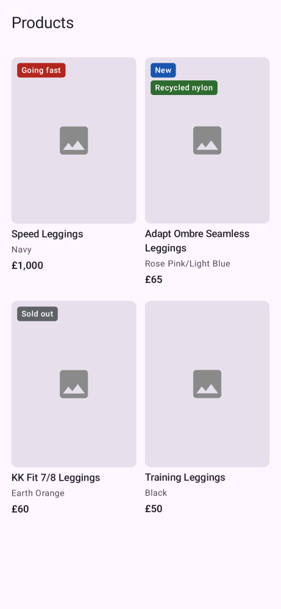
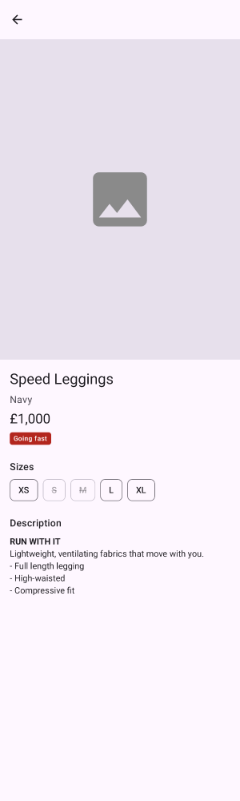

# SAET

Small Android app that loads a product feed and shows it in a grid, tap a product and you get a
detail screen. The networking and data stuff lives in a Kotlin Multiplatform module (so an iOS app
could reuse it later) and the UI is Jetpack Compose.

<p>
  
  
</p>

_These come from the Paparazzi snapshot tests. Snapshot tests have no network, so the product photos show the placeholder, which is also what the three broken-image products look like in the app._

## What it does

The list shows each product's image, title, colour and price. Labels from the feed (`going-fast`,
`new`, `recycled-nylon` etc) show up as little coloured badges on the image and anything out of stock
gets a "Sold out" badge. Three products in the feed have image URLs that all fail, so those fall back
to a plain placeholder instead of an empty box.

Tapping a product opens the detail screen with big image, price, labels, sizes (sold out ones are struck
through) and the description. The description comes in as HTML with quite a bit of editor junk in it
so I clean it up first and then render it as normal styled text.

There's a loading state, an error state with a "Try again" button and an empty state. I've checked it
in dark mode, with font size at 1.5x and in airplane mode.

## Running it

You need Android Studio with JDK 25 and the Android 37 SDK. The project is on AGP 9.4.1, Gradle 9.6
and Kotlin 2.2.10, min SDK is 26.

Open the project in Android Studio and run the `app` configuration, or from the terminal:

```
./gradlew :app:installDebug
```

## Tests

```
# Shared module: mapping, HTML cleaning, API and repository
./gradlew :shared:testAndroidHostTest

# App unit tests: ViewModels and snapshot rendering
./gradlew :app:testDebugUnitTest

# Snapshot tests: compare the screens against the recorded images
./gradlew :app:verifyPaparazziDebug

# Snapshot tests: re-record the images after an intentional UI change
./gradlew :app:recordPaparazziDebug

# Compose UI tests
./gradlew :app:connectedDebugAndroidTest
```

Roughly what's covered:

- Shared module: label parsing, price formatting, JSON to domain mapping, the HTML cleaner
  (with a real description from the feed), the Ktor API against `MockEngine` and the repository's
  caching, errors and cancellation.

- ViewModels: loading, content, error, retry.

- Compose UI: each screen in each state, clicks, and the accessibility labels on sold out sizes

- Snapshots: both screens in light, dark and at 1.5x font, plus the list error state. Images are in `app/src/test/snapshots/images`.

I wrote the tests first following TDD. Each feature has a `test(...)` commit with failing tests and then a `feat(...)` commit that makes them pass, so you can check out any test commit and see it fail. The snapshot tests are the exception, I added those at the end to lock in how the finished screens look.

No mocking library, just hand-written fakes. `FakeProductRepository` is about twenty lines and honestly
reads more like a description of the behaviour than mock setup does.

## How it's built

Basically: Ktor fetches the JSON, it gets parsed into DTOs, a mapper turns them into domain
`Product`s, the repository caches them and hands back a `Result`, and each ViewModel exposes a
`StateFlow` of a sealed UI state that a stateless Compose screen draws.

A few decisions I should probably explain.

Only the data layer is shared. Fetching, parsing, mapping and caching would be the same on iOS so
that's where KMP actually pays off, keeping the ViewModels and UI native is the safer split. It's also why networking is Ktor and not Retrofit (Retrofit's JVM only).

No use case layer, there isn't any business logic beyond the mapping, a use case would just forward
calls. Hilt is only in `:app`, the shared classes get their dependencies through constructors so an
iOS app could just create them by hand.

The repository returns `kotlin.Result` so failures are in the type and can't be quietly ignored. It
rethrows `CancellationException` so leaving a screen actually stops the work. There's no detail
endpoint so the detail screen just looks the product up in the list that's already cached, and a
`Mutex` stops both screens fetching at the same time.

For the description I went with Compose's `AnnotatedString.fromHtml` instead of a WebView. It keeps
the app's fonts and colours and respects font scaling. The HTML cleaning is in shared code so it can
be unit tested.

Badge colours are fixed rather than coming from the theme. I started with theme colours but the
badges sit on product photos which are light in both themes, and in dark mode the "New" badge pretty
much vanished. The fixed ones all have at least 6:1 contrast against the white text.

Products whose images fail still stay in the list. A failed image is a display problem, not a data
problem: the product is still valid and you can still buy it, so the card keeps its place and shows a
placeholder, which also stops the grid jumping around when an image fails. If the business didn't
want products without images listed, I'd filter them out in the search index rather than in the app,
so iOS, Android and web all behave the same.

## Assumptions

- Prices are whole pounds. The feed only gives a number so `65` shows as £65 and `1000` as £1,000.

- Zero or negative inventory = sold out (some sizes in the feed really do report negative stock).

- Products with no id or no title get skipped, you can't show or open them anyway.

- Labels the app doesn't know still show up, humanised and neutral (`back-in-stock` becomes
  "Back in stock").

- Only `http`/`https` image URLs are used, featured image first then the rest by position.

## Known rough edges

Things I spotted on my own review that I'd fix next:

- An out-of-stock product can show "Going fast" and "Sold out" at the same time (KK Fit 7/8 Leggings
  in Earth Orange does). Urgency labels should probably be hidden once something's sold out.

- `ProductDetailViewModel` reads the id from `SavedStateHandle` with the key `"productId"` instead
  of going through the type-safe route, so renaming the route property would only break at runtime.

- `testProduct()` is duplicated in `test` and `androidTest`. A shared test-fixtures module would
  remove that.

- The placeholder is just an icon, so an image that's still loading and one that failed look the
  same. Showing "Image unavailable" on error would make that clearer.

## What I'd do next

- iOS app in SwiftUI on top of `:shared`, it already compiles for iOS.

- Image gallery on the detail screen, all the URLs are already mapped.

- Pull to refresh. The repository already supports `forceRefresh` so it's mostly wiring.

- Offline cache with SQLDelight or Room KMP so the last list is there without a connection.

- CI (GitHub Actions or Bitrise) running all the tests above including snapshot verification.

- Feature modules once there's more than one feature. Maybe shared ViewModels via the KMP lifecycle
  libs if the iOS app should share presentation logic too.

- A proper colour scheme instead of the template purple, a typed error so it can actually say
  "you're offline", and analytics.

## How I used AI

I used AI as a pair programmer, and I want to be upfront about it.
**The architecture, the decisions and the quality bar were mine; AI wrote most of the code.**

### Tools

- Claude: first for planning, then Claude Code for the implementation.

### What I used it for

- Adding the project dependencies: the version catalogue, the KMP shared module, Hilt, Ktor, Coil,
  navigation and later Paparazzi, and checking which versions actually work together.

- Formatting the JSON side: the DTOs, the shared `Json` config and mapping the raw JSON into the
  domain model.

- Adding the domain and data layers in `:shared` (models, label parsing, price formatting, the HTML
  cleaner, the Ktor API and the cached repository).

- Building the Android app: the Hilt wiring, the ViewModels, the Compose screens and navigation.

- Adding the tests: unit tests, integration tests (the API and repository against Ktor's
  `MockEngine`, and the Compose UI tests on a device) and the Paparazzi snapshot tests.

- Drafting this README, which I then edited.

### My part

- **I chose the architecture.** It suggested a plain Android-only app with Retrofit. I went with a KMP
  shared data layer instead, which meant switching to Ktor, and kept the UI and ViewModels native.

- **I set the way of working: strict TDD, one milestone at a time.** Every milestone had to have
  failing tests first, failing for the right reason, before any implementation.

- **I reviewed every step before committing it myself.** Nothing went in that I hadn't read and
  understood, and I can walk through any file in the project.

- **I made the calls when things broke.** When the newer Ktor and serialization versions broke the iOS
  targets I chose to pin older versions rather than bump Kotlin.

- **I kept the scope tight on purpose.** The image gallery and pull-to-refresh went into "next steps"
  so the time went into clean, tested code instead.

- **Snapshot tests and the commit structure were my call** at the end, split so every commit builds
  and passes on its own.
